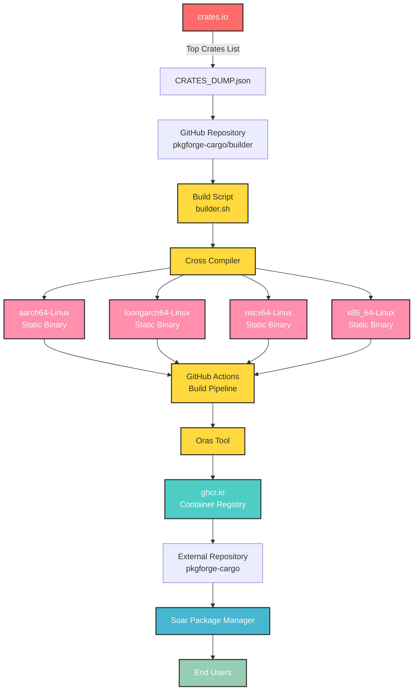

<div align="center">

[discord-shield]: https://img.shields.io/discord/1313385177703256064?logo=%235865F2&label=discord
[discord-url]: https://discord.gg/djJUs48Zbu
[doc-shield]: https://img.shields.io/badge/docs-soar.qaidvoid.dev-blue
[doc-url]: https://soar.qaidvoid.dev
[issues-shield]: https://img.shields.io/github/issues/pkgforge-cargo/builder.svg
[issues-url]: https://github.com/pkgforge-cargo/builder/issues
[license-shield]: https://img.shields.io/github/license/pkgforge-cargo/builder.svg
[license-url]: https://github.com/pkgforge-cargo/builder/blob/main/LICENSE
[stars-shield]: https://img.shields.io/github/stars/pkgforge-cargo/builder.svg
[stars-url]: https://github.com/pkgforge-cargo/builder/stargazers

[![Discord][discord-shield]][discord-url]
[![Documentation][doc-shield]][doc-url]
[![Issues][issues-shield]][issues-url]
[![License: MIT][license-shield]][license-url]
[![Stars][stars-shield]][stars-url]

</div>

<p align="center">
    <a href="https://soar.qaidvoid.dev/installation">
        
    </a><br>
</p>

<h4 align="center">
  <a href="https://soar.qaidvoid.dev">📘 Documentation</a> |
  <a href="https://docs.pkgforge.dev">🔮 PackageForge</a>
</h4>

<p align="center">
    Soar is a Fast, Modern, Bloat-Free Distro-Independent Package Manager that <a href="https://docs.pkgforge.dev/soar/comparisons"> <i>Just Works</i></a><br>
    Supports <a href="https://docs.pkgforge.dev/formats/binaries/static">Static Binaries</a>, <a href="https://docs.pkgforge.dev/formats/packages/appimage">AppImages</a>, and other <a href="https://docs.pkgforge.dev/formats/packages">Portable formats</a> on any <a href="https://docs.pkgforge.dev/repositories/soarpkgs/faq#portability"><i>*Unix-based</i> Distro</a>
</p>


## ℹ️ About
This repo, builds [top crates](https://github.com/pkgforge-cargo/builder/blob/main/data/CRATES_DUMP.json) from [crates.io](https://crates.io/) as Statically Linked relocatable binaries for `aarch64-Linux`, `loongarch64-Linux`, `riscv64-Linux` & `x86_64-Linux`.<br>
The [build script](https://github.com/pkgforge-cargo/builder/blob/main/scripts/builder.sh) uses [Cross](https://github.com/cross-rs/cross) to compile the crates on [Github Actions](https://github.com/pkgforge-cargo/builder/actions) & then uploads the artifacts to [ghcr.io](https://github.com/orgs/pkgforge-cargo/packages?repo_name=builder) using [Oras](https://github.com/oras-project/oras).<br>
All of which are downloadable & installable with soar by adding `pkgforge-cargo` as an [external repo](https://docs.pkgforge.dev/repositories/external/pkgforge-cargo).

## 🏗️ Build Constraints
- [Statically Linked](https://rust-lang.github.io/rfcs/1721-crt-static.html): `-C target-feature=+crt-static`
- [Self Contained](https://doc.rust-lang.org/beta/nightly-rustc/rustc_session/config/struct.LinkSelfContained.html): `-C link-self-contained=yes`
- [Nightly Toolchain](https://doc.rust-lang.org/cargo/reference/unstable.html): `+nightly`
- [All Features](https://doc.rust-lang.org/cargo/reference/features.html): `--all-features`
- [LTO](https://doc.rust-lang.org/cargo/reference/profiles.html#lto): `-C lto=yes`
- [All Optimizations](https://doc.rust-lang.org/cargo/reference/profiles.html#opt-level): `-C opt-level=3`
- [Stripped](https://doc.rust-lang.org/cargo/reference/profiles.html#strip): `-C debuginfo=none -C strip=symbols`
- Little/No Dependency on system libraries: Crates depending on system libraries will simply fail.
```bash
[+] Flags: -C target-feature=+crt-static \
           -C default-linker-libraries=yes \
           -C link-self-contained=yes \
           -C prefer-dynamic=no \
           -C embed-bitcode=yes \
           -C lto=yes \
           -C opt-level=3 \
           -C debuginfo=none \
           -C strip=symbols \
           -C link-arg=-Wl,-S \
           -C link-arg=-Wl,--build-id=none \
           -C link-arg=-Wl,--discard-all \
           -C link-arg=-Wl,--strip-all
```

## 🤖 Hosts & 🦀 Targets
| 🤖 `HOST_TRIPLET` | 🦀 `RUST_TARGET` |
|----------------|---------------|
| `aarch64-Linux` | `aarch64-unknown-linux-musl` |
| `loongarch64-Linux` | `loongarch64-unknown-linux-musl` |
| `riscv64-Linux` | `riscv64gc-unknown-linux-musl` |
| `x86_64-Linux` | `x86_64-unknown-linux-musl` |

## 🧰 Stats
> [!NOTE]
> - ℹ️ It is usual for most workflow run to `fail` since it's rare a crate builds for ALL `hosts`<br>
> - 🗄️ Table of Crates (Sorted by Rank): https://github.com/pkgforge-cargo/builder/blob/main/data/CRATES_PROCESSED.md<br>
> - 📜 List of Crates (Tried Building): https://github.com/pkgforge-cargo/builder/blob/main/data/QUEUE_LIST.txt
> - 📜 List of Crates (Actually Built): https://github.com/pkgforge-cargo/builder/blob/main/data/CACHE_LIST.txt
> - A single crate may provide several `executables` i.e `packages`.

| Source 🗃️ | Total Packages 📦 |
|------------|-------------------|
| 🦀 [**Crates (`Total`)**](https://github.com/pkgforge-cargo/builder/blob/main/data/CRATES_DUMP.json) | [](#) |
| 🦀 [**Crates (`Bin Only`)**](https://github.com/pkgforge-cargo/builder/blob/main/data/CRATES_BIN_ONLY.json) | [](#) |
| 🦀 [**Crates (`Processed`)**](https://github.com/pkgforge-cargo/builder/blob/main/data/CRATES_PROCESSED.json) | [](#) |
| 🦀 [**Crates (`Built`)**](https://github.com/pkgforge-cargo/builder/blob/main/data/CRATES_BUILT.json) | [](#) |
| 🦀 [**Crates (`Queued`)**](https://github.com/pkgforge-cargo/builder/blob/main/data/QUEUE_LIST.txt) | [](#) |
| 🦀 [**Packages (`aarch64-Linux`)**](https://github.com/pkgforge-cargo/builder/blob/main/data/aarch64-Linux.json) | [](#) |
| 🦀 [**Packages (`loongarch64-Linux`)**](https://github.com/pkgforge-cargo/builder/blob/main/data/loongarch64-Linux.json) | [](#) |
| 🦀 [**Packages (`riscv64-Linux`)**](https://github.com/pkgforge-cargo/builder/blob/main/data/riscv64-Linux.json) | [](#) |
| 🦀 [**Packages (`x86_64-Linux`)**](https://github.com/pkgforge-cargo/builder/blob/main/data/x86_64-Linux.json) | [](#) |
| 🦀 [**Packages (`Total Queued`)**](https://github.com/pkgforge-cargo/builder/blob/main/data/QUEUE_LIST.txt) | [](#) <sup>**`%`**</sup> |
| 🦀 [**Packages (`Total Built`)**](https://github.com/orgs/pkgforge-cargo/packages?repo_name=builder) | [](#) |

## 🔒 Security
- Crates are downloaded from [`crates.io`](https://crates.io/policies/security)
- CI/CD run on [Github Actions](https://docs.github.com/en/actions/security-for-github-actions/security-guides/security-hardening-for-github-actions)
- Build Logs are viewable using `soar log ${PKG_NAME}`
- Build Src is downloadable by downloading: [`{GHCR_PKG}-srcbuild-${BUILD_ID}`](https://github.com/orgs/pkgforge-cargo/packages?tab=packages&q=srcbuild)
- [Artifact Attestation](https://github.com/pkgforge-cargo/builder/attestations) & [Build Provenance](https://github.com/pkgforge-cargo/builder/attestations) are created/updated per build.

## 🟢 Workflow


