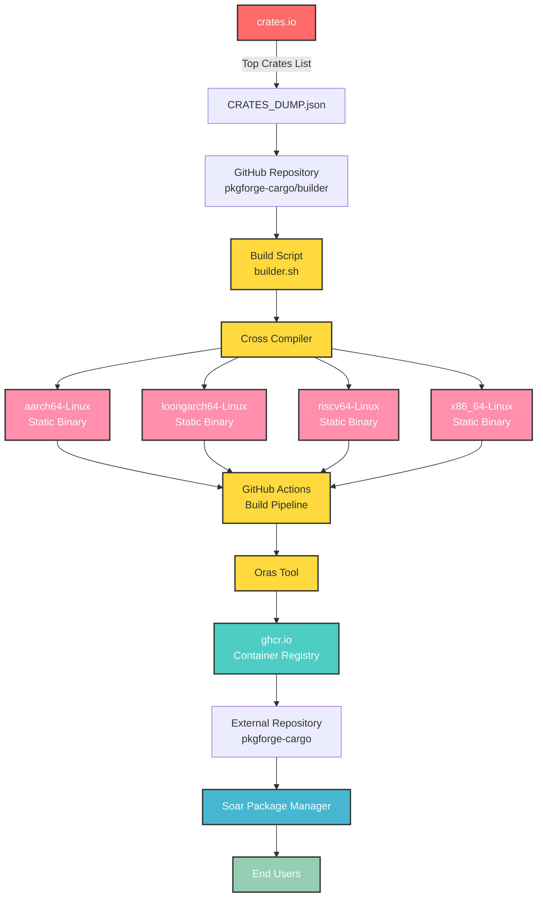

[discord-shield]: https://img.shields.io/discord/1313385177703256064?logo=%235865F2&label=discord
[discord-url]: https://discord.gg/djJUs48Zbu
[doc-shield]: https://img.shields.io/badge/docs-soar.qaidvoid.dev-blue
[doc-url]: https://soar.qaidvoid.dev
[issues-shield]: https://img.shields.io/github/issues/pkgforge-cargo/builder.svg
[issues-url]: https://github.com/pkgforge-cargo/builder/issues
[license-shield]: https://img.shields.io/github/license/pkgforge-cargo/builder.svg
[license-url]: https://github.com/pkgforge-cargo/builder/blob/main/LICENSE
[stars-shield]: https://img.shields.io/github/stars/pkgforge-cargo/builder.svg
[stars-url]: https://github.com/pkgforge-cargo/builder/stargazers

[![Discord][discord-shield]][discord-url]
[![Documentation][doc-shield]][doc-url]
[![Issues][issues-shield]][issues-url]
[![License: MIT][license-shield]][license-url]
[![Stars][stars-shield]][stars-url]

     

<h4 align="center">
  <a href="https://soar.qaidvoid.dev">📘 Documentation</a> |
  <a href="https://docs.pkgforge.dev">🔮 PackageForge</a>
</h4>

    Soar is a Fast, Modern, Bloat-Free Distro-Independent Package Manager that <a href="https://docs.pkgforge.dev/soar/comparisons"> <i>Just Works</i></a> 
    Supports <a href="https://docs.pkgforge.dev/formats/binaries/static">Static Binaries</a>, <a href="https://docs.pkgforge.dev/formats/packages/appimage">AppImages</a>, and other <a href="https://docs.pkgforge.dev/formats/packages">Portable formats</a> on any <a href="https://docs.pkgforge.dev/repositories/soarpkgs/faq#portability"><i>*Unix-based</i> Distro</a>

## ℹ️ About

This repo, builds [top crates](https://github.com/pkgforge-cargo/builder/blob/main/data/CRATES_DUMP.json) from [crates.io](https://crates.io/) as Statically Linked relocatable binaries for `aarch64-Linux`, `loongarch64-Linux`, `riscv64-Linux` & `x86_64-Linux`. 
The [build script](https://github.com/pkgforge-cargo/builder/blob/main/scripts/builder.sh) uses [Cross](https://github.com/cross-rs/cross) to compile the crates on [Github Actions](https://github.com/pkgforge-cargo/builder/actions) & then uploads the artifacts to [ghcr.io](https://github.com/orgs/pkgforge-cargo/packages?repo_name=builder) using [Oras](https://github.com/oras-project/oras). 
All of which are downloadable & installable with soar by adding `pkgforge-cargo` as an [external repo](https://docs.pkgforge.dev/repositories/external/pkgforge-cargo).

## 🤖 Hosts
- `aarch64-Linux`
- `loongarch64-Linux`
- `riscv64-Linux`
- `x86_64-Linux`

## 🟢 Workflow

